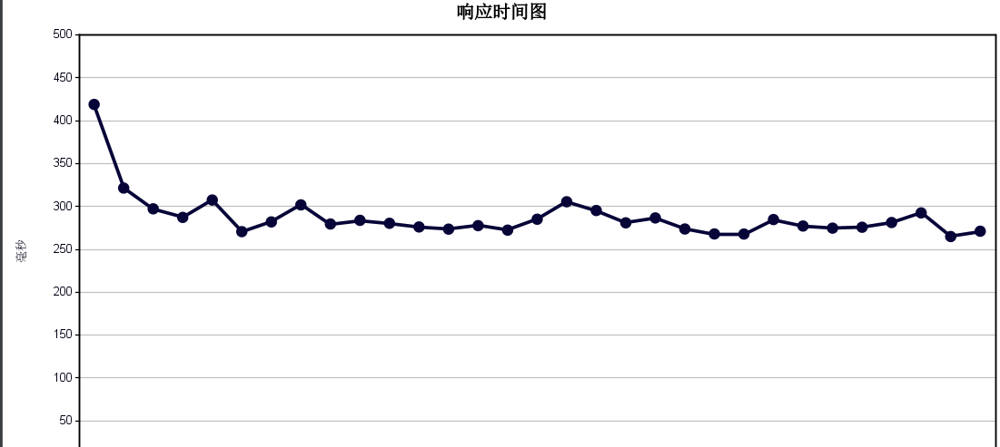
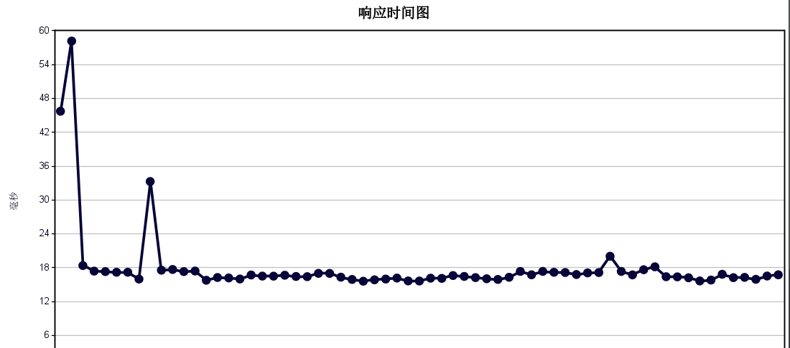
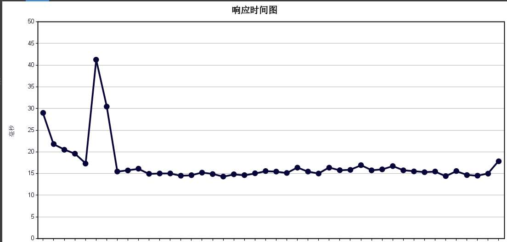
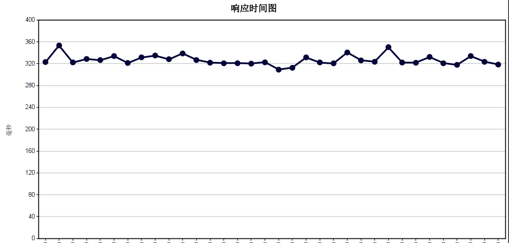
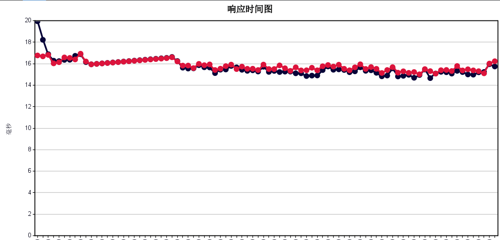
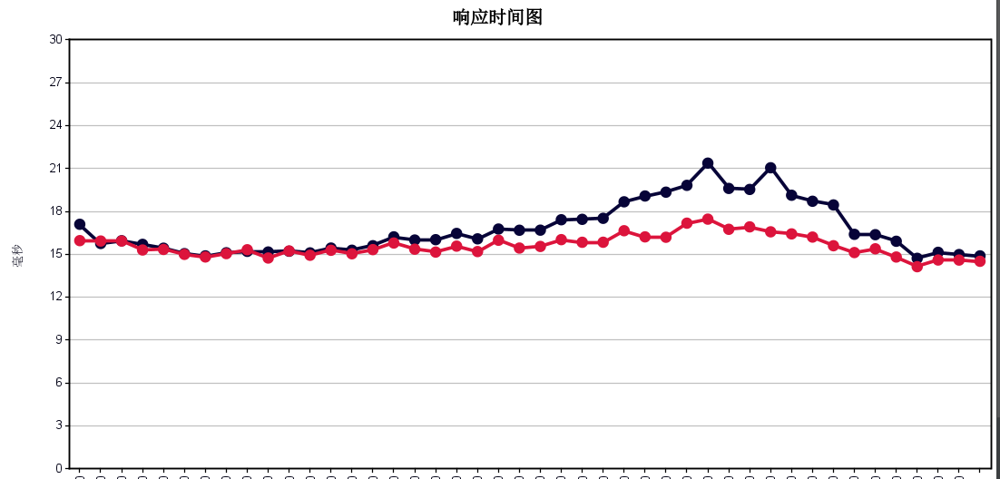
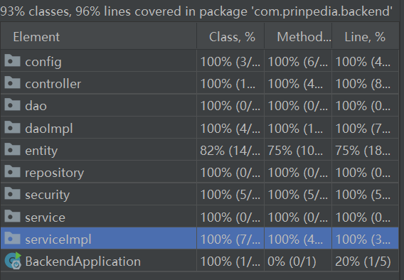

# 非功能性需求

## 性能

对于百科网站而言，由于词条数据量巨大，故用户在大量词条中进行搜索的性能是一项重要的非功能
性需求。百科网站中，用户通常会输入一个或多个关键字，服务端需要以此为基准从大量词条数据中
检索出与用户需求相匹配的词条，并给出响应推荐。

本项目采用了商用性能较好的Elasticsearch来存储词条的相关数据以供搜索，经过JMeter进行压力
测试后，可以得到，在100并发连续不停地发送搜索请求下，吞吐量峰值在360req/s左右，响应时间
均值为285ms，性能较好。同时，还在模拟用户行为的模式下进行了阶梯测试，在模拟1000并发用户
行为时，有99.999%的请求均能在1s内完成，符合百科网站的性能需求。

此外，还对其他接口和用户行为进行了压力测试，详见性能测试部分。

## 安全性

系统安全方面，后端利用了Spring Security框架实现了授权和认证。

由于百科网站的大部分功能理论上应该向全体互联网用户开放，故此类接口没有进行权限控制。如编辑
审核词条、收藏、锁定词条等功能实现了基于角色的权限控制。同时，对于一些以用户名为参数的接口，
对参数中的用户名和当前用户的用户名进行了比对。此外，对用户密码进行了强哈希加密以防止密码数据
泄露。

数据安全方面，出于数据的不同用途，词条的标题、摘要等信息存储在多个数据库中互为备份。此外，
针对存储词条详细信息的MongoDB数据库，采取了基于角色的权限控制，对用户读写数据库的权限进行
了严格的控制。

## 可观测性

本项目搭建了可观测性平台以方便运维。

### 健康检查

使用Actuator+Prometheus，通过接口暴露当前状态，实现了对当前系统运行情况的健康检查。

### 指标

通过Elastic Metric Beat收集后端和数据库运行时产生的相关数据，对CPU和内存使用率，请求数，
连接数等指标进行了统计和收集，并存储在Elasticsearch中，可以在Kibana里通过Dashboard进行
可视化的查询观测。

### 日志

搭建了ELK架构，通过Logstash收集后端的日志信息，处理后发送至Elasticsearch，并可通过Kibana
进行可视化的查询和全文检索。除了系统内置产生的日志外，还在关键业务处进行了埋点，输出重要日志，
以方便发现问题。

### 链路追踪

使用了Elastic APM，通过APM Agent和APM Server收集处理后端数据，并且集成相关指标，完成对
相关服务的监控与追踪。可以通过Elastic APM，可视化地展示响应时间统计、各服务耗时占比、应用
性能、错误信息等各种数据，比较完整全面地观测整个应用。

# 项目架构

## 前端

本项目前端基于Vue.js框架，部署于AWS S3 Bucket. 通过后端提供的RESTful API与后端进行通信。

## 后端

本项目后端基于Springboot框架，以单体的形式部署在AWS EC2实例上，接收前端发送的请求。

## 存储

由于项目中不同数据的用途、规模等特点不尽相同，故采用不同的数据库存储数据。
项目中用到的数据库如下：

* MySQL
* MongoDB
* Elasticsearch
* Neo4j

其中MySQL用以存储用户相关信息、词条标签等数据；MongoDB用来存储词条详细信息，编辑词条信息，反馈
信息等具有较长文本的数据；Elasticsearch中用来存储词条的标题和摘要以提供高性能搜索;Neo4j中以
图的形式存储词条之间的关系。

每个数据库以单体的形式单独部署于AWS EC2 实例上运行，接收并响应后端发送的请求。

## 其他

### 指标

为了实现对后端和数据库的观测，在每个运行数据库的实例上，同时部署了Elastic Metric Beat以收集
数据库相关指标。在运行后端的实例上，部署了Prometheus和Grafana以收集后端相关指标。

### 日志

日志方面，实现了ELK架构，即通过Logstash收集整理后端的日志信息，然后将格式化后的日志信息发送到
Elasticsearch中进行存储，之后通过Kibana实现对日志信息的较为方便的检索。为更好地利用资源，
Logstash和Kibana均与Elasticsearch部署在相同地实例上。

### 性能管理

性能管理方面，部署了Elastic APM以集成监控后端性能。将APM Server单独部署于一个EC2实例上以
接收数据，并将数据处理后发送给Elasticsearch，使用APM Agent代理Springboot以获得后端运行
时的状态信息并将此发送给APM Server。

# 性能测试

本项目通过部署在AWS EC2实例上的JMeter模拟前端请求，对主要业务进行压力测试。测试报告如下。

## 搜索业务

对搜索业务进行压力测试，100并发下，向搜索接口连续不间断发送请求。
发送约10万条请求后，统计数据，结果如下：

* 其中99.999%的请求响应时间小于2s

## 模拟用户行为的搜索

用户搜索时，往往不会不间断地发送请求，用户在获得搜索结果后，往往会停留一段时间，然后有
可能进行下一次搜索。故本测试中，为用户搜索设置按照高斯随机分布的时延，以模拟真实用户行为。
其中时延均值设置为3s，偏差为2s。500并发下，发送约10万条请求后，统计数据，结果如下：

* 其中99.999%的请求响应时间小于1s

## 模拟用户行为的搜索——阶梯测试

在上一测试情景中，500并发下，测试效果很好。为了探究系统的性能，在相同情景下进行了阶梯测试，
即并发数从0开始，每10s增加50并发数，直至并发数达到1000后，持续60s，然后每秒钟减少10并发
回复至零。统计数据，结果如下：

* 共计约8万条请求，响应时间均小于1s

## 获取词条详细信息

用户搜索得到结果后，如果有满意的结果，会点击进入查看该词条的详细信息。此业务也属于百科网站
中最主要的业务之一。100并发下，向该接口连续不断地发送请求。
发送约10万条请求后，统计数据，结果如下：

* 共计约10万条请求，响应时间均小于1s

## 模拟用户行为的搜索+查看词条

在实际情况下，用户的搜索往往会和查看词条详细信息相联系，即：用户先搜索得到结果，随之点击
某个词条查看其详细信息，如果不满意，会返回并重新进行搜索，如此往复。故本测试中，设计用户
反复进行搜索和查看词条详细信息两个请求并顺序执行，并设置搜索后时延均值为1s，偏差为0.5s，
查看词条后时延均值3s，偏差1s。500并发下，发送约10万条请求后，统计数据，结果如下：

## 模拟用户行为的搜索+查看词条——阶梯测试

在上一测试情景中，500并发下，测试效果很好。为了探究系统的性能，在相同情景下进行了阶梯测试，
即并发数从0开始，每10s增加50并发数，直至并发数达到1000后，持续60s，然后每秒钟减少10并发
回复至零。统计数据，结果如下：

# 单元测试

## 后端

后端基于JUnit5进行了比较充分的单元测试，对Controller层、Service层、Dao层和Spring Security
相关测试。测试总体上比较充分，代码覆盖率较高，所有自己写的代码覆盖率都基本达到了100%.

单元测试结果如下：

